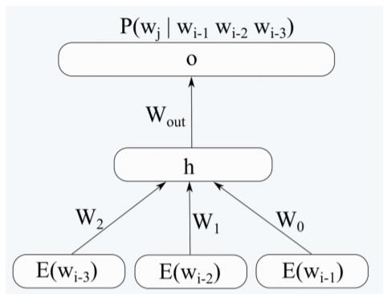
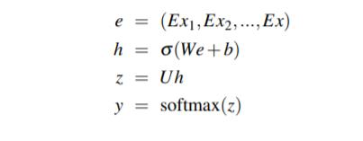
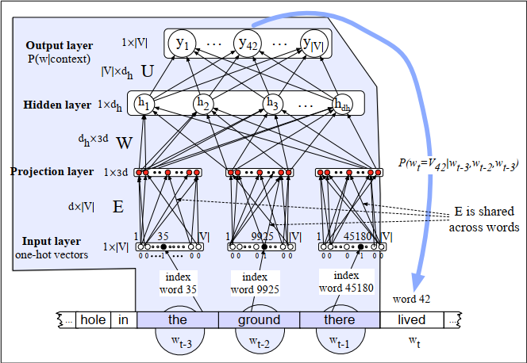

# Creating a Language Model based on Feed Forward Neural Network

## Introduction

This exercise was completed in preparation for the Natural Language Processing (NLP) course at [Tehran University](https://ut.ac.ir/en) in April 2020.

The aim of this project is to create a language model using the FF neural network and then investigate the effect of different parameters on the quality of this language model. Two files train.txt and test.txt are available for model training and evaluation, respectively.

The input of this network is word embedding vectors in the first layer, and in the output, the probability of that word is the next word assigned to each of the words in the vocabulary. To evaluate the output of the network during training, use the cross-entropy cost function and use gradient descent to train it. In general, the different layers of this network are as follows:

## Q1: 
__A -__	Implement the desired network. For the first layer, you can use pre-trained vectors (glove.6B.50d). Consider the number of input context words equal to 4, the number of hidden layer neurons equal to 35 and the learning rate equal to 0.02 and perform the following experiments.

__B -__	Report an overview of how to implement, how to initialize parameters, how to update parameters at each step, and the stop training condition.

__C -__	Get the graph of perplexity values for different iterations for train and test data and analyze the graph.

__D -__	Based on the number of different context words in the input (2, 3), two new language models were trained, report the perplexity of the obtained models on the test set and compare and analyze these models with each other by drawing a graph.

__E -__	Retrain the model for the learning rate of 0.03, 0.01 and 0.1 and analyze and compare the perplexity of the obtained model in each iteration on the test set by drawing a graph.

__F -__	Change the number of hidden layer neurons to 100, 50 and 150, train the model again and analyze and compare the perplexity of the model obtained on the test set by drawing a graph.

## Q2:
In the previous question, pre-trained vectors were used as input to the network. In this question, word vectors are trained inside the network itself. The input of this network are one-hot vectors of words.

__A-__	Implement the above network. Consider the word embedding vectors as 50-dimensional, the number of input context words as 4, the number of hidden layer neurons as 35, and the learning rate as 0.2.

__B-__	Obtain the graph of perplexity values for different iterations for train and test data, analyze the graph and compare it with the results of part c of question 1.

You can see the report of the work done [here](CA3-Report.pdf).

## Project source code

[FFNN_LM_5gram_35h_lr_0_02_glove notebook](CA3/CA3_FFNN_LM_5gram_35h_lr_0_02_glove.ipynb) 

* Input: 4 embedded words-vector size=200
* Output: one-hot vector with a size of 57500
* Number of neurons in hidden layer: 35
* Learning rate: 0.02
 

[FFNN_LM_4gram_35h_lr_0_02_glove notebook](CA3/CA3_FFNN_LM_4gram_35h_lr_0_02_glove.ipynb) 

* Input: 4 embedded words-vector size=150
* Output: one-hot vector with a size of 57500
* Number of neurons in hidden layer: 35
* Learning rate: 0.02
 

[FFNN_LM_3gram_35h_lr_0_02_glove notebook](CA3/CA3_FFNN_LM_3gram_35h_lr_0_02_glove.ipynb) 

* Input: 4 embedded words-vector size=100
* Output: one-hot vector with a size of 57500
* Number of neurons in hidden layer: 35
* Learning rate: 0.02
 

[FFNN_LM_5gram_35h_lr_0_01_glove notebook](CA3/CA3_FFNN_LM_5gram_35h_lr_0_01_glove.ipynb) 

* Input: 4 embedded words-vector size=200
* Output: one-hot vector with a size of 57500
* Number of neurons in hidden layer: 35
* Learning rate: 0.01
 

[FFNN_LM_5gram_35h_lr_0_03_glove notebook](CA3/CA3_FFNN_LM_5gram_35h_lr_0_03_glove.ipynb) 

* Input: 4 embedded words-vector size=200
* Output: one-hot vector with a size of 57500
* Number of neurons in hidden layer: 35
* Learning rate: 0.03
 

[FFNN_LM_5gram_35h_lr_0_1_glove notebook](CA3/CA3_FFNN_LM_5gram_35h_lr_0_1_glove.ipynb) 

* Input: 4 embedded words-vector size=200
* Output: one-hot vector with a size of 57500
* Number of neurons in hidden layer: 35
* Learning rate: 0.1
 

[FFNN_LM_5gram_50h_lr_0_02_glove notebook](CA3/CA3_FFNN_LM_5gram_50h_lr_0_02_glove.ipynb) 

* Input: 4 embedded words-vector size=200
* Output: one-hot vector with a size of 57500
* Number of neurons in hidden layer: 50
* Learning rate: 0.02
 

[FFNN_LM_5gram_100h_lr_0_02_glove notebook](CA3/CA3_FFNN_LM_5gram_100h_lr_0_02_glove.ipynb) 

* Input: 4 embedded words-vector size=200
* Output: one-hot vector with a size of 57500
* Number of neurons in hidden layer: 100
* Learning rate: 0.02
 

[FFNN_LM_5gram_150h_lr_0_02_glove notebook](CA3/CA3_FFNN_LM_5gram_150h_lr_0_02_glove.ipynb) 

* Input: 4 embedded words-vector size=200
* Output: one-hot vector with a size of 57500
* Number of neurons in hidden layer: 150
* Learning rate: 0.02
 

[FFNN_LM_5gram_35h_lr_0_2_onehot notebook](CA3/CA3_FFNN_LM_5gram_35h_lr_0_2_onehot.ipynb) 

* Input: 4 one-hot words-vector size=230000
* Embedding layer: size of 200
* Output: one-hot vector with a size of 57500
* Number of neurons in hidden layer: 35
* Learning rate: 0. 2
 